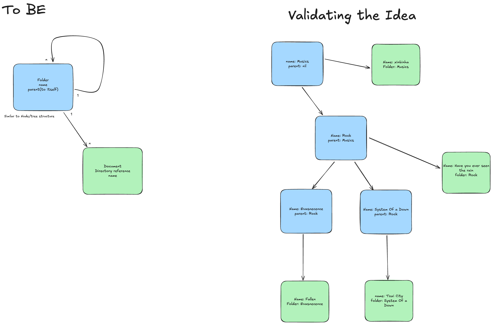

# Processo de Desenvolvimento do Projeto

## 1. Configuração Inicial do Ambiente

Nesta etapa, criei os **Dockerfiles** necessários para gerar o projeto Rails e configurei o ambiente para iniciar o desenvolvimento.

---

## 2. Preparação do Projeto

Nesta etapa, instalei e configurei gems essenciais para padronizar convenções, facilitar testes e garantir qualidade de código. Foram adicionar gems como:
- `rspec-rails`
- `shoulda-matchers`
- `factory_bot_rails`
- `faker`

---

## 3. Planejamento e Rascunhos

Antes de iniciar a implementação do projeto, criei esboços que me ajudaram a entender o problema, documentar o *schema* e validar a ideia. O esboço(TO-BE) e a ideação estão na imagem abaixo:

---

## 4. Fluxo de Desenvolvimento

A partir desta fase, adotei as seguintes práticas em todo o ciclo de desenvolvimento:
- Criei testes com **RSpec** para cada arquivo.
- Usei **RuboCop** e **Brakeman** para garantir padrões de código, boas práticas e segurança.
- Executei testes frequentes no ambiente de desenvolvimento para assegurar funcionalidade e qualidade.
- Mantive 100 % de cobertura de testes, focando na confiabilidade de cada funcionalidade.

---

## 5. Criação das Entidades

Desenvolvi as entidades (models) e o *schema* do sistema, validando cada etapa com testes automatizados. A sequência foi:
1. **Diretório**: modele­i a estrutura como uma árvore. Pois dessa maneira era mais fácil para mim entender a abstração
2. **Documento**: implemente­i o gerenciamento de arquivos usando **ActiveStorage**.

---

## 6. Endpoints

Optei por criar endpoints **nested** entre diretórios e documentos, resultando em rotas RESTful mais organizadas. Para documentar e testar a API, utilize­i a gem **Rswag**, que facilita a geração de documentação interativa e a verificação dos endpoints.

---

## 7. Documentação Final

Por fim, escrevi as instruções de execução do projeto e descrevi meu raciocínio de desenvolvimento no `README`.

Espero que gostem do que desenvolvi por aqui e que o passo a passo esteja claro e objetivo, ajudando na compreensão do fluxo de trabalho!

[← Voltar ao README](../README.md)